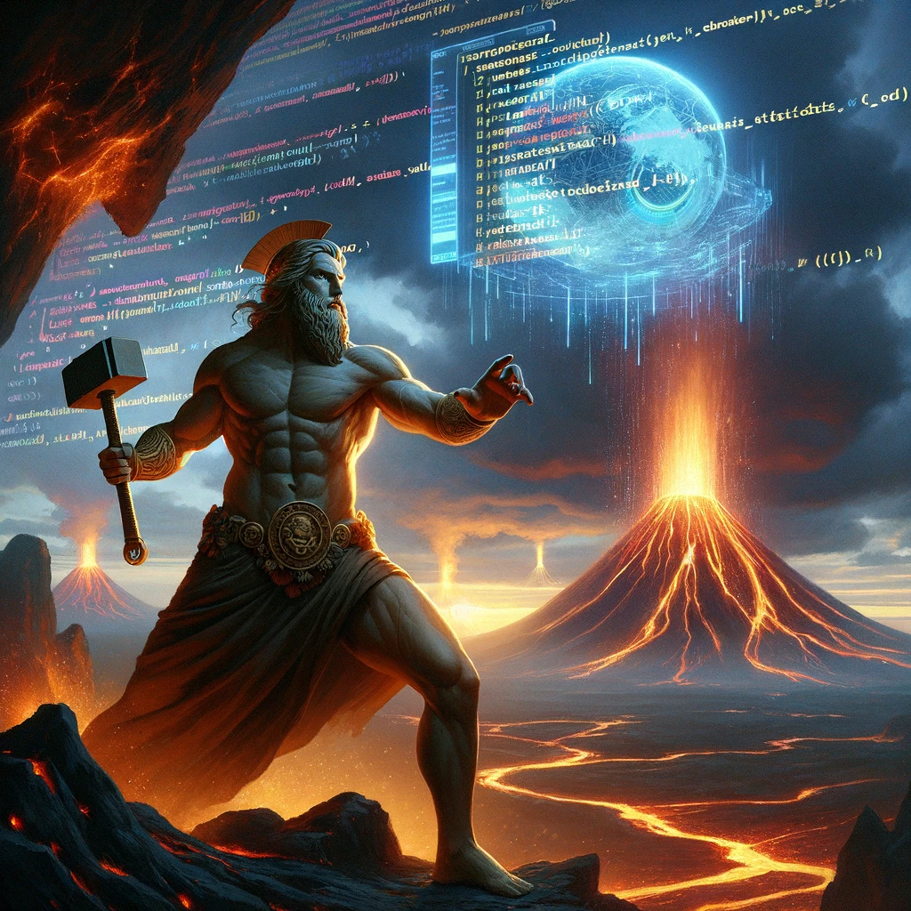
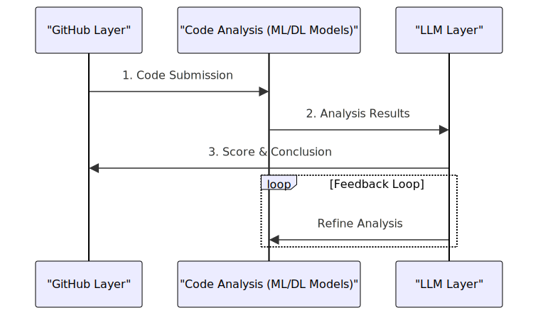

# VULsCAN 🌋

VULsCAN is an innovative cybersecurity project designed to fortify the digital defenses of code repositories on GitHub. 
Named after Vulcan, the Roman god of fire, VULsCAN embodies the strength and vigilance required to protect software from the ever-evolving threats in the cyber realm. This advanced tool leverages a potent combination of Machine Learning (ML), 
Deep Learning (DL), and Large Language Models (LLM) to meticulously analyze code across various programming languages such as Python, C++, and others.

Upon receiving a GitHub repository link, VULsCAN springs into action, parsing through the code to identify potential vulnerabilities and sensitive information that could pose a risk. 
Its capabilities extend beyond simple pattern recognition; VULsCAN understands the context and semantics of the code, thanks to its cutting-edge LLM integration. This allows for a nuanced analysis that can pinpoint complex security issues which conventional tools might overlook.

Furthermore, VULsCAN is not just a static analysis tool; it is a dynamic solution that learns and evolves. With each scan, the system fine-tunes its detection algorithms, becoming more adept at identifying new and sophisticated vulnerabilities. 
This self-improving mechanism ensures that VULsCAN remains at the forefront of cybersecurity technology, offering robust protection against both current and future threats.

In essence, VULsCAN represents a groundbreaking approach to software security. By harnessing the power of advanced computational techniques, it offers a comprehensive, intelligent, and evolving defense mechanism for software projects. 
VULsCAN is not just a tool but a guardian, dedicated to securing the digital creations of today against the threats of tomorrow.

# Project Diagram

- GitHub Layer: The process starts with code submission from GitHub.
- Code Analysis (ML/DL Models): This layer involves analysis by machine learning/deep learning models, such as transformers, to evaluate the code.
- LLM Layer: The large language model analyzes the results from the previous step, scoring them and providing conclusions on aspects like vulnerabilities and sensitive information found in the code.
- Feedback Loop: There's a cyclic feedback loop where the LLM layer sends information back to the ML/DL models to refine the analysis.

